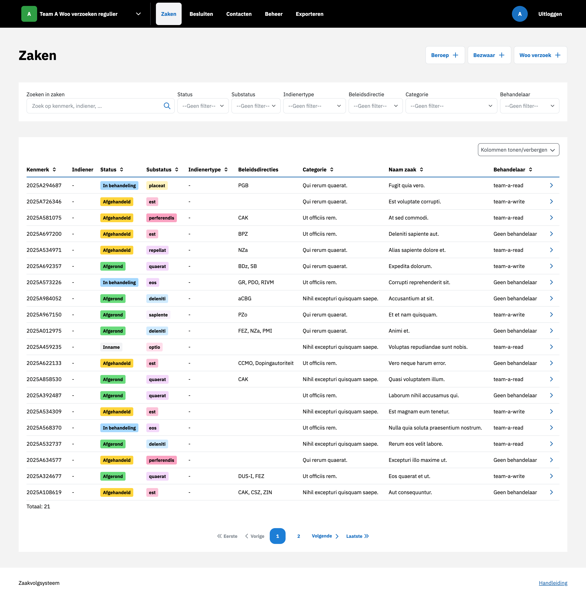
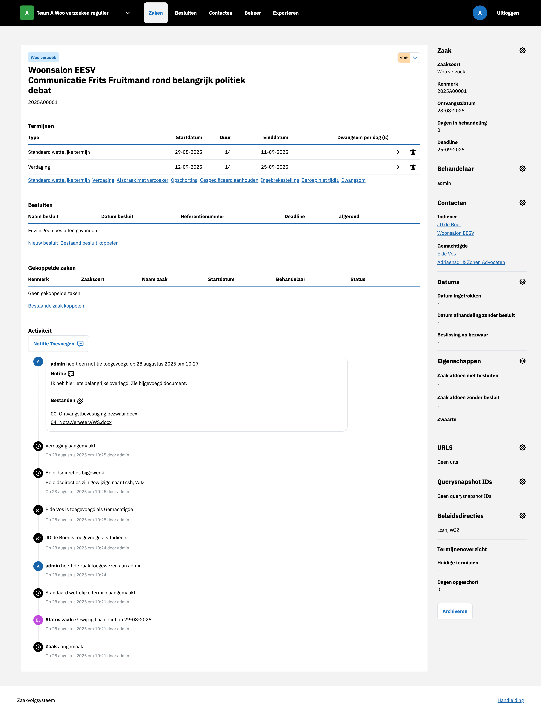

.. _Zaken:

Zaken
=====

Nieuwe zaak aanmaken
--------------------
Een nieuwe zaak kan worden aangemaakt door in het overzicht te kiezen voor een van de zaaksoorten rechts boven de tabel.
Nadat alle velden zijn ingevuld en bevestigd, wordt de zaak aangemaakt en zichtbaar in het systeem.

Zaak bewerken
-------------

Zaak bewerken door Behandelaar toe te wijzen
^^^^^^^^^^^^^^^^^^^^^^^^^^^^^^^^^^^^^^^^^^^^
U kunt een behandelaar toewijzen via de sidebar door op het tandwiel te klikken naast Behandelaar en een behandelaar te selecteren.
Na het toewijzen is de gekozen behandelaar zichtbaar in de sidebar.
Tevens verschijnt er een item in de tijdlijn waarin de toewijzing wordt geregistreerd.

Zaak bewerken door Indiener, Gemachtigde en Instantie toevoegen
^^^^^^^^^^^^^^^^^^^^^^^^^^^^^^^^^^^^^^^^^^^^^^^^^^^^^^^^^^^^^^^
Een bestaande zaak kan worden uitgebreid door een indiener, gemachtigde en behandelaar toe te voegen via de sidebar door op het tandwiel te klikken naast :ref:`Contacten`.
In het zoekveld kunt u zoeken naar het Contact in de lijst.
Indien een Contact niet eerder is ingevoerd kunt u onder :ref:`Contacten` een nieuw contact toevoegen.
U kunt ieder contact koppelen als zijnder Indiener, Gemachtigde of Instantie.
Gekoppelde :ref:`contacten` zijn zichtbaar in de sidebar.
Tevens verschijnt er een item in de tijdlijn waarin de toevoegingen worden geregistreerd.

Zaakstatus aanpassen
^^^^^^^^^^^^^^^^^^^^
De substatus van een zaak kan handmatig worden aangepast via de zaakdetailpagina door op de status naast de titel te klikken.
Na opslaan is de nieuwe status zichtbaar in de zaaktabel en wordt er een item toegevoegd aan de tijdlijn.

Notitie toevoegen (met bestand uploaden)
^^^^^^^^^^^^^^^^^^^^^^^^^^^^^^^^^^^^^^^^
Notities zijn toe te voegen aan de tijdslijn door op Notitie te klikken.
Er kunnen naast een tekst ook meerdere bestanden worden toegevoegd aan de notitie.
De notite verschijnt in de tijdslijn en de bijgevoegde bijlages kunnen worden gedownload door er op te klikken.
