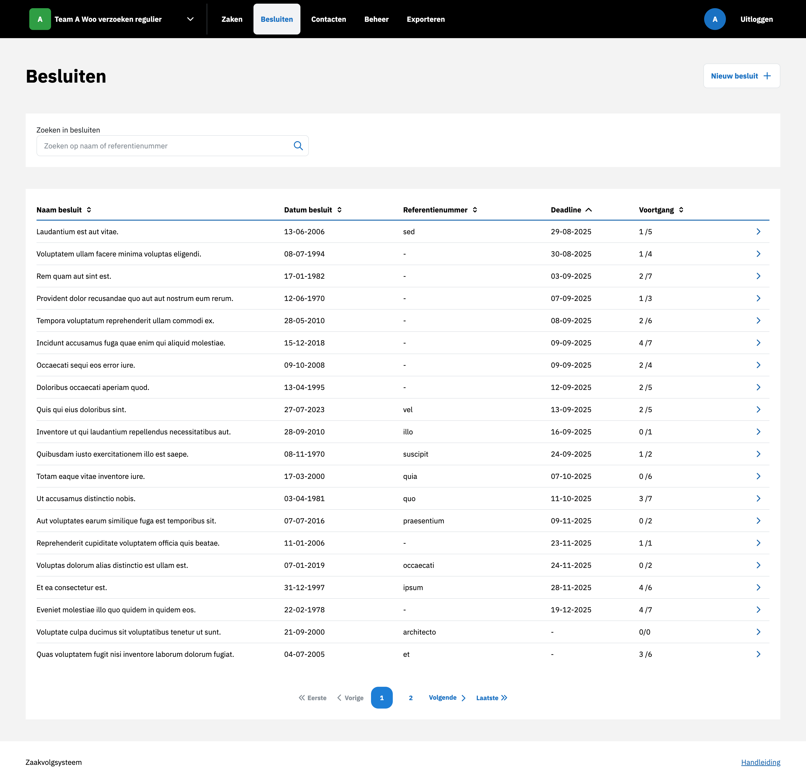

.. _Besluiten:

Besluiten
=========

Nieuwe besluit aanmaken
-----------------------
Een nieuw besluit kan worden aangemaakt door in het overzicht te klikken op Nieuw besluit.
Nadat alle velden zijn ingevuld en bevestigd, wordt het besluit aangemaakt en zichtbaar in het systeem.

Nieuw besluit koppelen aan zaken
--------------------------------
Er kan een nieuw besluit aan :ref:`zaken` worden toegevoegd door op de besluitdetailpagina een nieuw besluit aan te maken.
Nadat alle velden zijn ingevuld en bevestigd, wordt het besluit aangemaakt en is het zichtbaar in het systeem.
Het besluit is tevens zichtbaar in de besluitentabel van alle gekoppelde :ref:`zaken`.

Bestaand besluit koppelen aan zaken
-----------------------------------
Een bestaand besluit kan worden gekoppeld aan :ref:`zaken` door het referentienummer van het besluit in te voeren.
Na koppeling wordt het besluit zichtbaar in de besluitentabel.

Gekoppeld besluit ontkoppelen
-----------------------------
Een gekoppeld besluit kan worden ontkoppeld door op het ontkoppel-icoon te klikken.
Na ontkoppeling verdwijnt het besluit uit de Besluiten tabel en wordt er een item in de tijdlijn toegevoegd in zowel de besluit als het besluit.
