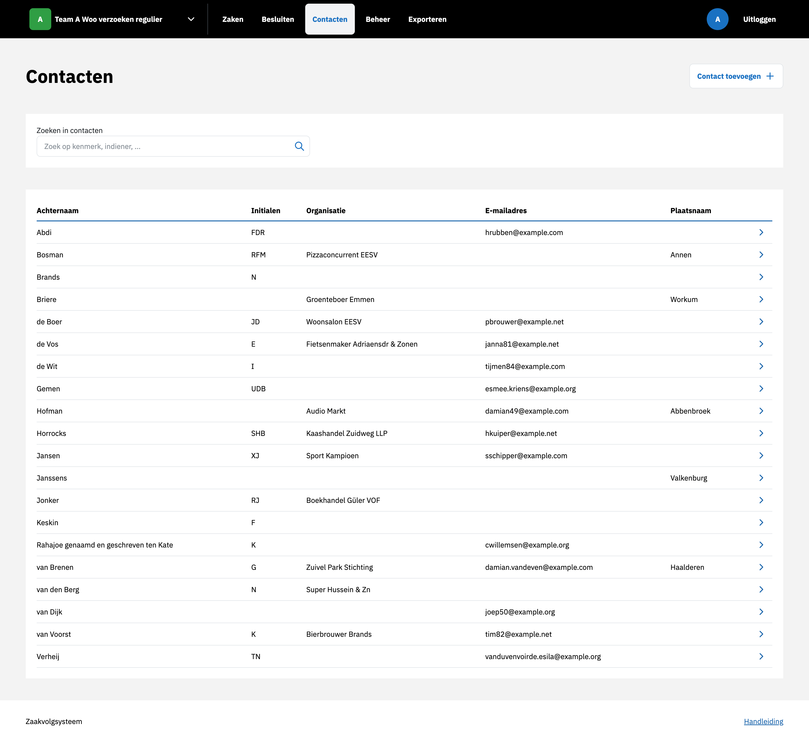

.. _Contacten:

Contacten
=========

Nieuw contact aanmaken
----------------------
Een nieuw contact kan worden toegevoegd via het overzicht **Contacten**.
Na het invullen van vereiste velden en het kiezen van een type wordt het contact opgeslagen.

**Let op**: een contact dient ten minste een *Achternaam* óf een *Organisatie* te hebben - afhankelijk van wat er wordt ingevuld kan een Contact dus verwijzen naar een natuurlijk persoon of een rechtspersoon.

Aangemaakte contacten kunnen worden gekoppeld aan :ref:`zaken` door in de zaak detailpagina in de sidebar op het tandwiel naast Contacten te klikken.

Contact bewerken
----------------
Een contact kan worden aangepast door op de contact detailpagina op de knop *Contact bewerken* te klikken.
In het formulier dat verschijnt zijn alle gegevens van een contact aanpasbaar.
Alle :ref:`zaken` die gekoppeld zijn aan het contact hebben zo direct toegang tot de gewijzigde contactgegevens.
